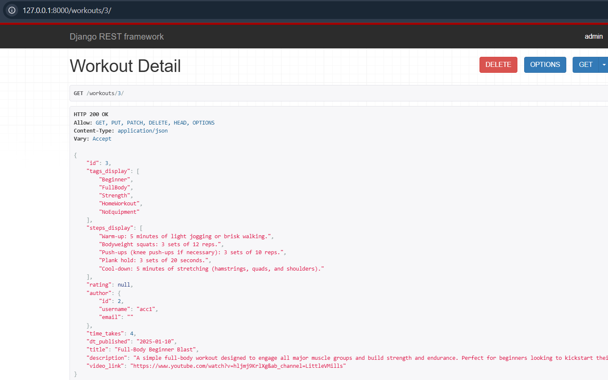
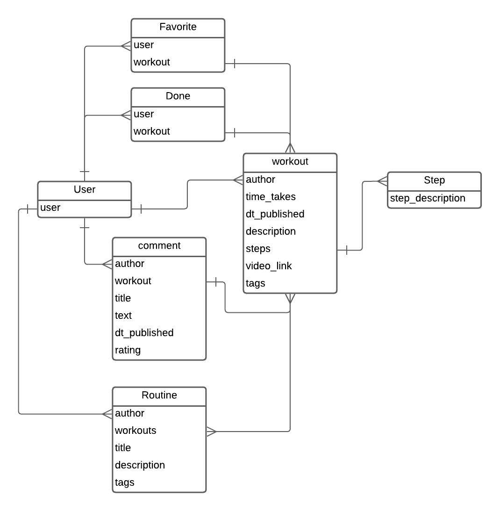

# Платформа для фитнес-тренировок и здоровья

## Общий функционал

Часть функционала доступна без регистрации.

Незарегистрированные пользователи могут:
- просматривать тренировки
- искать тренировки
- смотреть тренировки, которые создал пользователь
- смотреть сборники тренировок
- читать комментарии к тренировкам

Зарегистрированные пользователи могут:
- создавать тренировки
- создавать коллекции тренировок
- отмечать тренировки выполненными (флаг для фильтрации)
- отмечать тренировки любимыми (флаг для фильтрации)
- комментировать тренировки


## Описание эндпоинтов

``` 
/workouts
    / - список всех тренировок
    [POST]
    /<id> - полная информация о тренировке, CRUD от автора
        [GET, PATCH, DELETE]
        /mark_done - инвертирует текущую связь
        [POST]
        /mark_favorite - инвертирует текущую связь
        [POST]
    /random
    [GET]
/comments
    [NONE]
    /<id> - CRUD от автора
    [GET, PATCH, DELETE]
    /workout/<workout_id> - список комментариев для тренировки
    [GET, POST]
/routines
    /
    [GET, POST]
    /<id>
    [GET, PATCH, DELETE]
/account
    / - просто информация о пользователе
    [GET, PATCH]
    /favorites
    [GET]
    /done
    [GET]
    /comments
    [GET]
/auth
/admin
```
GET - запрос к записи:

## Модель базы данных


Код
```python
from django.contrib.auth.models import User
from django.core.validators import MinValueValidator, MaxValueValidator
from django.db import models


# Create your models here.
class Step(models.Model):
    step_description = models.TextField()

    def __str__(self):
        return self.step_description


class Tag(models.Model):
    tag_name = models.CharField(max_length=100)

    def __str__(self):
        return self.tag_name


class Workout(models.Model):
    author = models.ForeignKey(User, on_delete=models.CASCADE)
    time_takes = models.PositiveIntegerField(blank=True, null=True)  # 15 minutes per 1 unit
    dt_published = models.DateField(auto_now_add=True)

    title = models.CharField(max_length=100)
    description = models.TextField()

    steps = models.ManyToManyField(Step)
    tags = models.ManyToManyField(Tag)
    video_link = models.URLField(blank=True, null=True)

    def __str__(self):
        return self.title


class Comment(models.Model):
    author = models.ForeignKey(User, on_delete=models.SET_NULL, null=True)
    workout = models.ForeignKey(Workout, on_delete=models.CASCADE)
    title = models.CharField(max_length=100)
    comment = models.TextField()
    dt_published = models.DateField(auto_now_add=True)
    rating = models.PositiveIntegerField(blank=True, null=True,
                                         validators=[
                                             MinValueValidator(1),
                                             MaxValueValidator(10)
                                         ])

    def __str__(self):
        return f'{self.title} by {self.author.username}'


class Favorite(models.Model):
    user = models.ForeignKey(User, on_delete=models.CASCADE)
    workouts = models.ForeignKey(Workout, on_delete=models.CASCADE)


class Done(models.Model):
    user = models.ForeignKey(User, on_delete=models.CASCADE)
    workouts = models.ForeignKey(Workout, on_delete=models.CASCADE)


class Routine(models.Model):
    author = models.ForeignKey(User, on_delete=models.SET_NULL, null=True)
    workouts = models.ManyToManyField(Workout)

    title = models.CharField(max_length=100)
    description = models.TextField()

    tags = models.ManyToManyField(Tag)
```
1. Step – Модель представляет собой шаг тренировки, содержащий описание шага.
   
2. Tag – Модель для тегов, используемых для классификации тренировок и программ.

3. Workout – Основная модель тренировки. Она содержит информацию о времени выполнения, дате публикации, названии, описании, шагах, тегах и ссылке на видео.

4. Comment – Комментарий к тренировке, включающий автора, заголовок, сам комментарий, дату публикации и рейтинг.

5. Favorite – Отметка, что пользователь добавил тренировку в избранное.

6. Done – Отметка, что пользователь завершил выполнение данной тренировки.

7. Routine – Программа, которая может включать несколько отдельных тренировок, а также имеет автора, название, описание и теги.