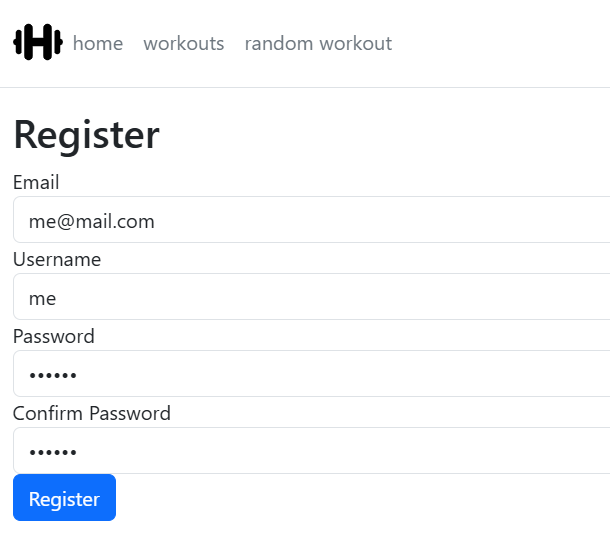
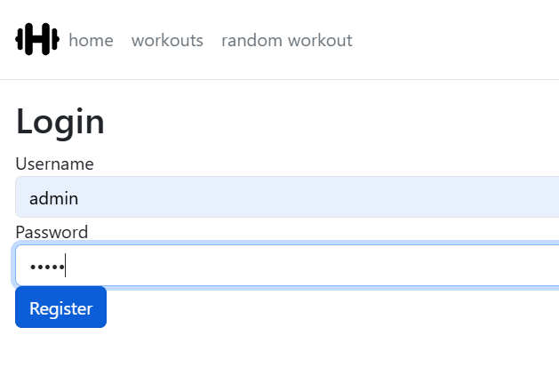
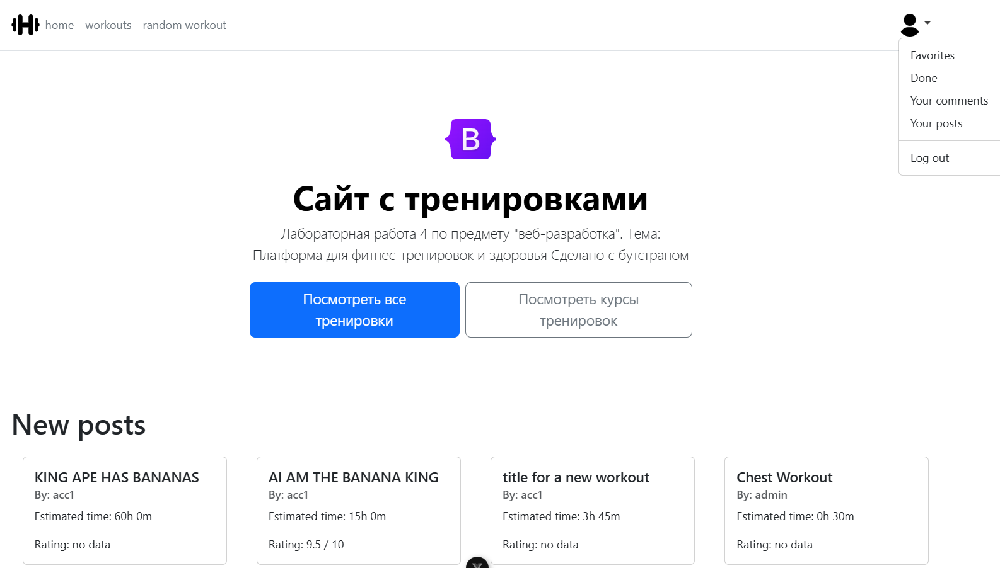
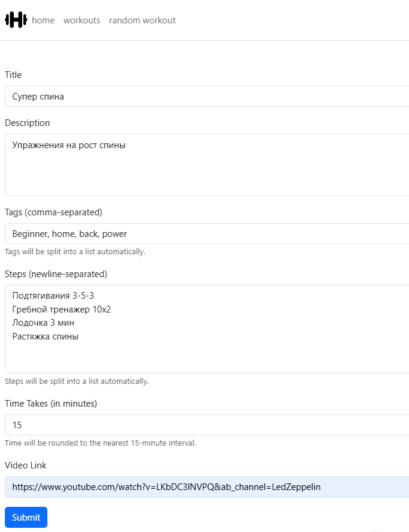
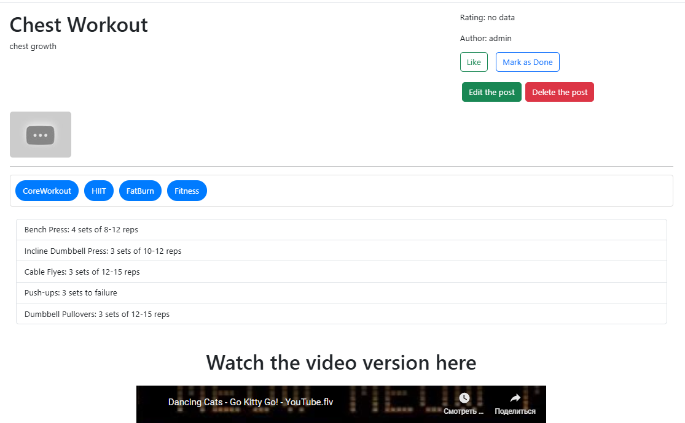
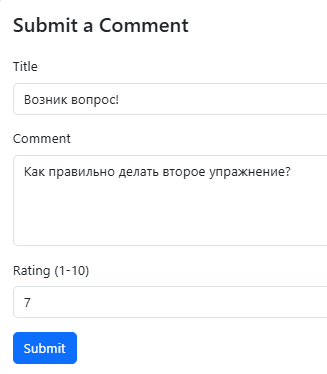
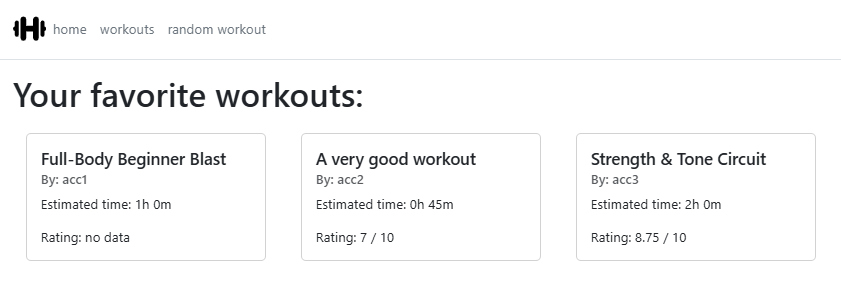
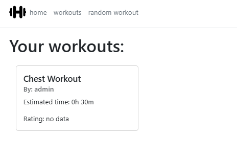

#Реализация клиентской части средствами Vue.js.
---

## Описание
Проект представляет собой веб-приложение для публикации тренировок. Основная цель - предоставить удобную платформу для пользователей, где они смогут создавать, просматривать и управлять своими тренировочными программами.
## Ход работы
В рамках проекта были созданы соответствующие эндпоинты в Vue Router, а также описаны составные компоненты и представления. Для реализации функциональности использовались как Composition API, так и Options API, а также пропсы и сигналы. Для стилизации сайта было принято решение использовать стандартные элементы Bootstrap в комбинации с кастомными CSS классами.
## Интерфейсы
### Вход и регистрация

### Главная страница

### Все тренировки

### Форма публикации

### Просмотр записи

### Поле формы комментария

### Списки избранных и выполненных

### Список опубликованных

### 404 Not Found 😢😢😢

